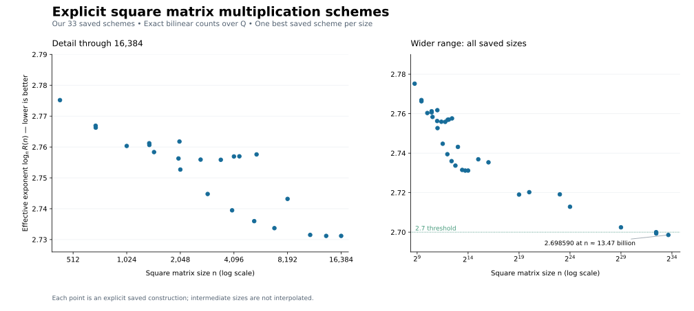

# Explicit matrix multiplication schemes

A catalogue of **41 explicit rational schemes for square matrix multiplication**, with exact multiplication counts, compact coefficient descriptions, and finite proof witnesses.

Most schemes use Coppersmith–Winograd (CW) tensor restrictions, rational compression and composition with published algorithms. Three small explicit schemes, at sizes 14, 16 and 32, use one product fewer than the best published counts (LITA): **1,593**, **2,236** and **14,196**. Every coefficient is accessible as an exact rational number.

Between sizes 1,024 and 65,536, the best entries come from a Z4-symmetric CW packet quotiented to 7 products and fed to Strassen's algorithm. Size **9,826** needs **74,352,484,826** multiplications (effective exponent **2.723013**), and size **1,024** needs **198,683,936**, 1.42% fewer than 14,197² = 201,554,809 obtained by squaring LITA's size-32 scheme. The catalogue also includes a size-13,468,840,704 scheme with exponent **2.698590**.



The left panel shows our saved schemes through size 16,384; the right panel shows the same catalogue over the full size range. Both use a logarithmic size axis.

The exponent of a finite scheme is **logₙ R**, where R counts bilinear scalar multiplications. Additions and multiplications by fixed constants are excluded. These are algebraic reference constructions; the counts do not establish a practical speedup over numerical matrix multiplication libraries.

## Quick start

Requires Python 3.11 or newer. From a checkout:

```bash
python -m pip install .
cwschemes info 16384
```

```python
import cwschemes

s = cwschemes.load(16384)
assert s.n == 16384
assert s.rank == 317774199680
u = s.coefficient("U", term=0, row=0, col=0)  # fractions.Fraction
print(u)
```

No search needs to be rerun. All required scheme data is included, compressed and hash-checked. Resources are unpacked on demand into `~/.cache/cwschemes`; set `CWSCHEMES_CACHE` to choose another directory. The full coefficient arrays are never allocated.

First use of a construction can take minutes to build exact intermediate tables. Subsequent queries reuse those tables. See the [release checks](checks/summary.json) for measured verification results.

## Catalogue

| Square size | Multiplications | Effective exponent |
|---:|---:|---:|
| [14](schemes/14.json) | 1,593 | 2.793942453 |
| [16](schemes/16.json) | 2,236 | 2.781676118 |
| [32](schemes/32.json) | 14,196 | 2.758639372 |
| [686](schemes/686.json) | 70,153,048 | 2.766272903 |
| [1,024](schemes/1024.json) | 198,683,936 | 2.756589999 |
| [2,048](schemes/2048.json) | 1,303,338,368 | 2.752687685 |
| [8,192](schemes/8192.json) | 45,396,314,240 | 2.723219701 |
| [9,826](schemes/9826.json) | 74,352,484,826 | 2.723013418 |
| [16,384](schemes/16384.json) | 317,774,199,680 | 2.729229360 |
| [65,536](schemes/65536.json) | 14,507,078,850,188 | 2.732613893 |
| [536,870,912](schemes/536870912.json) | 390,821,774,252,911,273,874,842 | 2.702443346 |
| [5,873,299,070](schemes/5873299070.json) | 237,674,020,365,443,824,643,488,557 | < 2.7, exactly checked |
| [13,468,840,704](schemes/13468840704.json) | 2,162,272,334,177,007,487,103,296,378 | 2.698590115 |

See [catalogue.json](catalogue.json) for all sizes, or run `cwschemes list`.

The first sub-2.7 size **in this catalogue** is obtained by padding to a natural size-5,905,580,032 construction. Its unchanged rank R satisfies

```text
5,873,299,069^27 <= R^10 < 5,873,299,070^27.
```

This establishes the strict threshold for that scheme, not the smallest possible matrix size. Its exponent at the natural size is 2.699342235. The new power-21 support computes 5,032 independent products; one packet and 123 recursive remainders supply the 5,155 calls of the original size-22 outer scheme.

## Z4-quotient schemes (sizes 1,024 to 65,536)

These 20 entries (format `cw-z4-quotient-square-v1`, or `z4-quotient-v1` units inside a mixed outer scheme) share one CW support and one relation certificate.

- **Packet.** A power-9 CW support with 28 rows is invariant under a cyclic group Z4 permuting the 9 coordinates. Its rows form 7 free Z4-orbits. The packet tensor is the local completion G_q^{⊗9} restricted to the support, plus Möbius corrections on the 36 sunflower kernels; it equals 28 independent ⟨q³⟩ products.
- **Compression.** In the joint triangular representation, patterns whose factor vanishes on the support are removed. A Z4-invariant pair Gram elimination then deletes 300 more patterns, and its relations are absorbed into the output factor. Both steps delete whole Z4-orbits and leave the two input factors equivariant.
- **Quotient.** On Z4-invariant inputs, all columns of one orbit give the same product. One multiplication per column orbit, whose output factor sums over the orbit, computes the 7 row-orbit products independently. The unit rank is

  ```text
  R7(q) = (q^9 + 17q^8 + 122q^7 + 392q^6 + 493q^5 + 131q^4 + 2q^3 + 2q^2) / 4.
  ```

- **Sizes.** Strassen's 7 products give ⟨2q³⟩ with R7(q) multiplications for q = 8, …, 20; sizes 4,096, 5,324 and 13,500 are padded from these. Sizes 10,976 and 16,384 place 7 units inside Strassen squared. Size 32,768 places 48 units inside ⟨8;336⟩. Size 65,536 places 319 units inside the explicit ⟨16;2236⟩ scheme (see below); its 3 remaining products use the size-4,096 entry.

The relation data does not depend on q. It was replayed exactly over Q for every q from 2 to 25 before inclusion; `cwschemes verify <n> --exact` replays it again at the q in use.

## Explicit schemes at sizes 14, 16 and 32

These three entries store every coefficient explicitly (sparse rational factor matrices, format `explicit-qcsr-square-v1`). They are new points of the exact (γ, r₀) parameter family of the [LITA](https://github.com/khoruzhii/lita) row–column aggregation scheme. Two of LITA's three parameter views are unchanged; the third is re-anchored so that one more raw term vanishes (at size 32: 14,314 raw terms − 104 vanishing − 14 merged = 14,196). The same choice gives one product fewer than LITA's published counts 1,594, 2,237 and 14,197.

`cwschemes verify 32` evaluates the algorithm on random matrices modulo 2³¹−1; `cwschemes verify 32 --exact` checks every tensor coefficient modulo enough primes to certify equality over Q (a few minutes of CPU at size 32).

## Verify

```bash
# Integrity, exact support/completion identities, counts and coefficient queries:
cwschemes verify 16384
cwschemes verify --all

# Reconstruct and check the rational compression relations as well:
cwschemes verify 432 --exact --threads 1
cwschemes verify 9826 --exact

# An uncompressed large construction has no compression relations to replay:
cwschemes verify 5873299070 --exact
```

The default checks are not advertised as a full reduction proof. `--exact` additionally rebuilds the relevant Gram matrices and checks the supplied rational relations, or checks exact zero-factor norms. It can take substantially longer and use more memory, especially for refined orbit proofs. Verification must run without Python's `-O` flag.

The mathematical basis consists of the documented CW identities, group projections, composition rules and published primitive schemes. This is an arithmetic certificate checker, not a formal proof-assistant development. Read [verification.md](docs/verification.md) for the precise scope and the release checks actually performed.

## Literature comparison

The figure displays only our saved schemes; the three explicit small schemes are drawn as diamonds and the Z4-quotient schemes as squares. Literature comparisons remain available in the accompanying data; the size-432 candidate loses its finite-size comparison and is marked in [counts.csv](comparisons/counts.csv). The catalogue does not claim globally optimal ranks or independently established records.

- Up to 16,384, the comparison data uses the same product, padding and scalar-peeling closure for published constructions alone and for published constructions augmented with our saved schemes.
- At larger sizes, each comparison is one explicit published construction, not an exhaustive literature optimum.

The comparison pins [LITA](https://github.com/khoruzhii/lita/tree/c1dd9225df98676e385b53ae7517ff2ea0ec5779) at rank **14,197** for size 32 and includes its even and applicable odd families; the explicit size-14, 16 and 32 entries are one below these pinned counts. Other sources are the [Lille catalogue](https://fmm.univ-lille.fr/) and the documented [Schwartz–Zwecher recompression](https://arxiv.org/abs/2508.01748). Existing scheme certificates retain the older primitive versions with which they were constructed.

The saved points have [exact comparison recipes](comparisons/recipes.json). [Source revisions](comparisons/sources.json), [all point counts](comparisons/counts.csv), and the [dense finite closure](comparisons/closure.csv) are included.

To rebuild the figure from these pinned inputs:

```bash
python -m pip install '.[plot]'
python comparisons/build.py
```

## Format and reuse

The public API uses the direct-output convention

```text
C[i,j] = Σₜ W[t,i,j] (Σₐᵦ U[t,a,b] A[a,b]) (Σ꜀𝒹 V[t,c,d] B[c,d]).
```

Scheme descriptors point to immutable compressed objects. Shared proof objects and recursive leaves are stored once; no files from the discovery repository are required. See [format.md](docs/format.md), [construction.md](docs/construction.md) and the [small runnable example](examples/strassen.py).

The original search programs, cluster launchers, logs and experimental dependencies are deliberately absent. Third-party source and seed provenance is documented in [third_party.md](docs/third_party.md). See [LICENSE](LICENSE) and [CITATION.cff](CITATION.cff) for reuse and citation.
